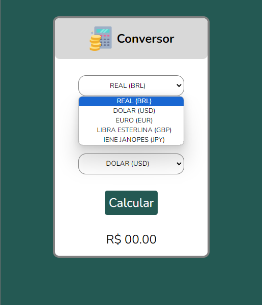

 <h1>:money_with_wings: Conversor de Moeda </h1>

Conversor de moedas que permite aos usuários converter valores de uma moeda para outra.

Obs: Neste momento estou trabalhando com taxas de cambio aproximadas! (futuramente irei integrar com uma API)

## Funcionalidades

- Conversão de moeda em tempo real.
- Suporte a várias moedas, incluindo Real (BRL), Dólar (USD), Euro (EUR), Libra Esterlina (GBP), Iene Japonês (JPY).
- Interface de usuário amigável e fácil de usar.
- Validação de entrada para garantir que os valores inseridos sejam válidos.
- Exibição de resultados formatados com precisão.

## <h2> Link </h2>

   https://cicilin1.github.io/Conversor-de-moeda/
